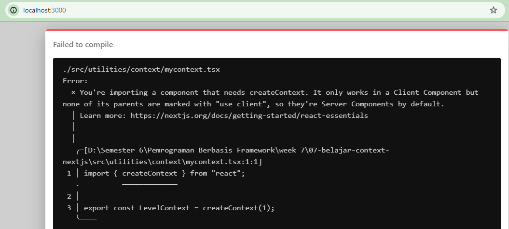
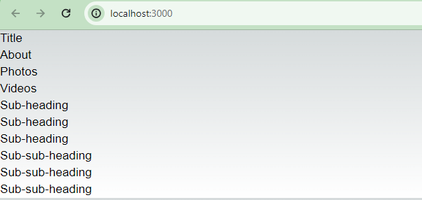
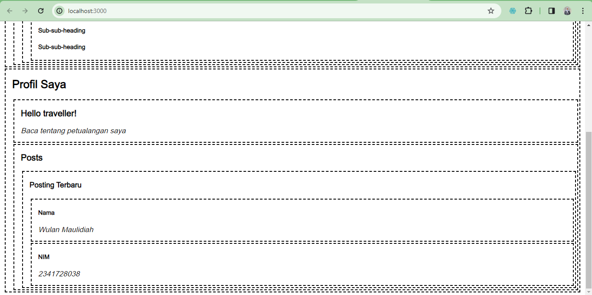
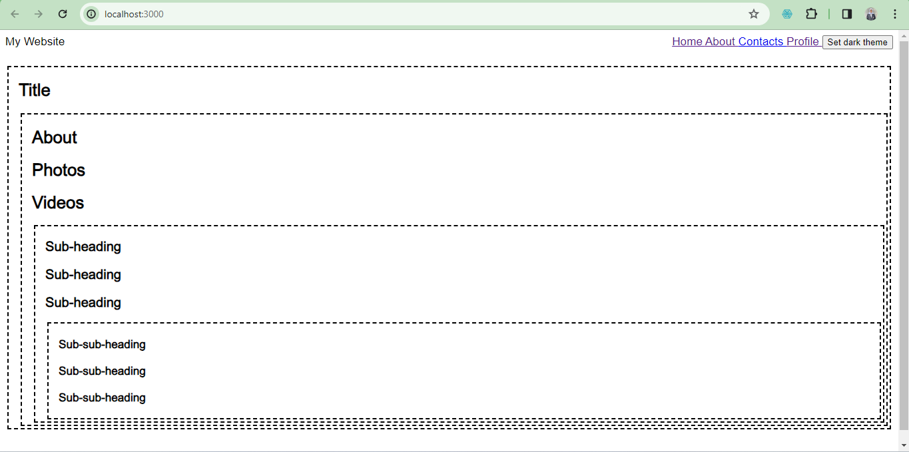
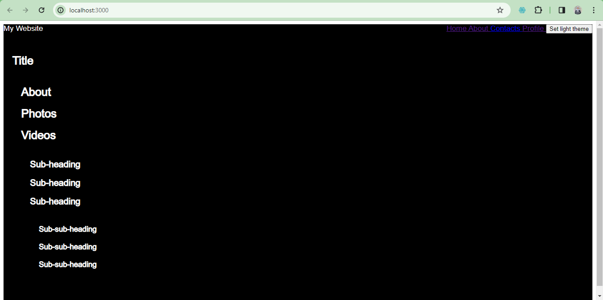

This is a [Next.js](https://nextjs.org/) project bootstrapped with [`create-next-app`](https://github.com/vercel/next.js/tree/canary/packages/create-next-app).

## Getting Started

First, run the development server:

```bash
npm run dev
# or
yarn dev
# or
pnpm dev
# or
bun dev
```

Open [http://localhost:3000](http://localhost:3000) with your browser to see the result.

You can start editing the page by modifying `app/page.tsx`. The page auto-updates as you edit the file.

This project uses [`next/font`](https://nextjs.org/docs/basic-features/font-optimization) to automatically optimize and load Inter, a custom Google Font.

## Laporan Minggu Ke-7
Nama: Wulan Maulidiah <br>
NIM: 2341728038 <br>
Kelas: TI 3A

1. Dalam praktikum 1 tersebut kita menggunakan heading dan section menggunakan props children yang telah diinisialisasikann sebelumnya pada file heading dan section di folder atoms. <br>
 

2. Pada soal ini terjadi error karena kita mengimpor sebuah komponen yang membutuhkan createContext. Sehingga dibutuhkan 'use client' agar dapat dideteksi bahwa file mycontext.ts bagian dari komponen klien.
 

3. Pada bagian ini kita belajar menggunakan context dalam react, yang mana dapat digunakan untuk menyebarkan data ke seluruh komponen tanpa harus melewati prop secara langsung dari komponen induk ke komponen anak. Komponen 'Section' menggunakan Context untuk menentukan tingkat kedalaman (level) dari hierarki tersebut, dan kemudian mengoperasikan informasi ini ke komponen anaknya, seperti 'Heading'
 

4. Membuat context dengan melewati komponen perantara. Menambahkan Nama dan NIM di bagian komponen Post.


5. Membuat toggle button berfungsi <br>
- halaman dengan light theme

- halaman dengan dark theme


Untuk membuat tema menjadi permanen meskipun halaman telah direfresh atau dipindahkan, kita bisa menyimpan preferensi tema pengguna di dalam penyimpanan lokal, seperti localStorage atau sessionStorage.